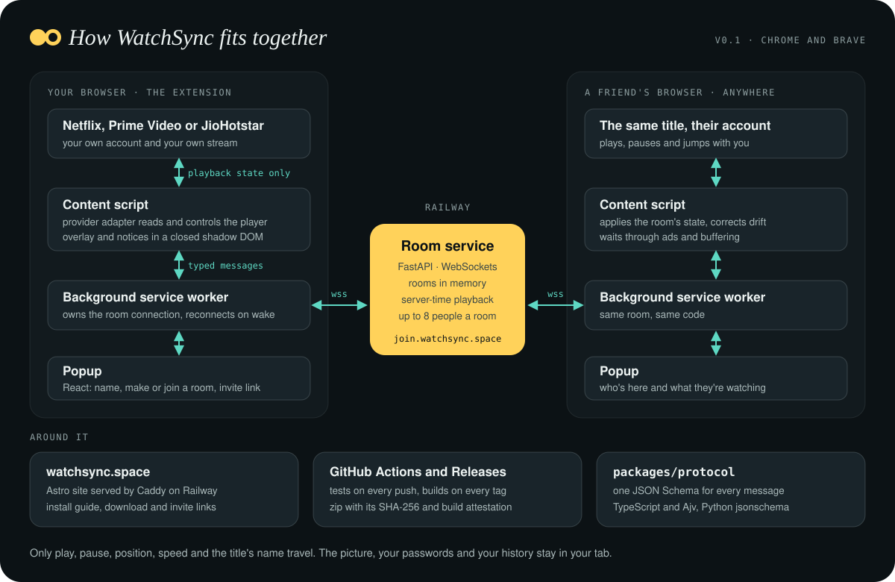

<p align="center">
  <a href="https://watchsync.space"></a>
</p>

<p align="center">
  <strong>Movie night with friends in other cities, in sync.</strong><br />
  A browser extension for Chrome and Brave. Each of you watches on your own Netflix, Prime Video or JioHotstar account; WatchSync keeps the tabs in step.
</p>

<p align="center">
  <a href="https://github.com/SuhaasNv/watchsync/releases/latest/download/watchsync-extension.zip"><strong>Download</strong></a>
  ·
  <a href="https://watchsync.space">Website</a>
  ·
  <a href="https://watchsync.space/install/">How to install</a>
  ·
  <a href="CHANGELOG.md">Release notes</a>
  ·
  <a href="https://watchsync.space/faq/">FAQ</a>
</p>

<p align="center">
  <a href="https://github.com/SuhaasNv/watchsync/actions/workflows/ci.yml"></a>
</p>

## How it works

1. **Make a room.** Click WatchSync, pick a name, create a room and send the link to your friends.
2. **Open the same title.** If someone is on another episode, WatchSync offers to open the right one.
3. **Press play.** Play, pause and skips reach everyone. When someone hits an ad or a slow connection, the room waits for them and says why, then starts again together.

## Works with

| Service | Play, pause, skip | Next episode | Waits for ads |
|---|---|---|---|
| Netflix | Yes | Yes | Waits while someone buffers |
| Prime Video | Yes | Friends pick it in the player | Yes, with the time left |
| JioHotstar | Yes (not live streams) | Yes | Yes, still being checked on real accounts |

Not affiliated with Netflix, Amazon or JioStar.

## Install

WatchSync isn't in the Chrome Web Store yet, so you load it yourself. It takes a minute:

1. [Download the zip](https://github.com/SuhaasNv/watchsync/releases/latest/download/watchsync-extension.zip) and unzip it. Keep the folder.
2. Open `chrome://extensions` (or `brave://extensions`) and turn on **Developer mode**.
3. Click **Load unpacked** and choose the unzipped folder.
4. Pin WatchSync from the puzzle icon in the toolbar.

The [install guide](https://watchsync.space/install/) walks through it with pictures. When a new version is out, the popup tells you.

## Is it safe?

You install WatchSync from outside the Chrome Web Store, so Google hasn't reviewed it. This is what it can reach, from its [manifest](apps/extension/build.mjs):

- **`storage`**: your name, and your room for up to 24 hours so you can rejoin after a restart.
- **The room service at `join.watchsync.space`**: sends play, pause and the position to your room, and opens invite links.
- **Netflix, Prime Video and JioHotstar pages** (`netflix.com`, `primevideo.com`, Amazon's `/gp/video/` pages, `jiohotstar.com`, `hotstar.com`): reads whether the video is playing, where it is and which title is open, applies play, pause and jumps from your room, and shows small notices on the player.
- **`scripting`**: when WatchSync is installed or updated, adds its own packaged scripts to Netflix, Prime Video and JioHotstar tabs that are already open, so you don't have to reload them. Same sites as above, nothing else.
- **GitHub's public API, at most once a day**, to see whether a newer version is out.

It never reads the picture, the sound or the rest of the page, never sees passwords, payments or browsing history, runs on no other site, loads no code from the internet, and has no analytics or ads.

Each release zip is built by GitHub Actions from a tagged commit on `main` with the public [release workflow](.github/workflows/release.yml). The [release notes](https://github.com/SuhaasNv/watchsync/releases) name the commit, link to the build, and list the SHA-256 of every file (also in `SHA256SUMS.txt`). To check your download, compare it with the release's SHA-256:

```bash
shasum -a 256 watchsync-extension.zip                       # macOS
certutil -hashfile watchsync-extension.zip SHA256           # Windows
sha256sum watchsync-extension.zip                           # Linux
gh attestation verify watchsync-extension.zip -R SuhaasNv/watchsync   # signed build provenance
```

The last command uses the [GitHub CLI](https://cli.github.com/) to check GitHub's signed record that this repository's workflow built that exact file. Chrome's banner about developer-mode extensions appears for every extension loaded outside the Chrome Web Store; it's about where the extension came from, not something Chrome found in it.

## Privacy

WatchSync shares only what keeps you in sync: your name, the room, and whether you're playing or paused and where. It never reads the picture, records anything, or touches your account. Rooms live in memory and disappear soon after everyone leaves. Details: [privacy notice](https://watchsync.space/privacy/).

## For developers

<p align="center">
  
</p>

| Part | Folder | Built with |
|---|---|---|
| Extension | `apps/extension` | Chrome Manifest V3, TypeScript (strict), React popup, esbuild, closed shadow DOM overlay |
| Room service | `services/signaling` | Python 3.12, FastAPI, WebSockets, Pydantic, Uvicorn, uv; rooms in memory |
| Protocol | `packages/protocol` | One JSON Schema, generated TypeScript types, Ajv and Python jsonschema validation |
| Website | `apps/website` | Astro, static, served by Caddy |
| Hosting | | Railway (room service and website, production and a dev environment that sleeps when idle) |
| CI and releases | `.github/workflows` | GitHub Actions: lint, types, unit and end-to-end tests (Vitest, Playwright, pytest), Docker builds, release zip with SHA-256 and build attestation |

Each person streams from their own account. The extension reads and commands playback only (playing or paused, position, speed, title); it never touches the video, its decryption or your account.

```bash
pnpm install
cd services/signaling && uv sync && uv run uvicorn app.main:app --reload   # room service on :8000
pnpm --filter @watchsync/extension dev                                     # builds apps/extension/dist, rebuilds on change
```

Load `apps/extension/dist` with **Load unpacked**. Before a merge, run `pnpm check` (lint, types, unit tests, the extension's end-to-end tests against a mock player, and the room service's tests). The website runs with `pnpm --filter @watchsync/website dev` and tests with `pnpm --filter @watchsync/website e2e`.

Releases are tags on `main`; each one publishes the zip above. Deploys and releases: [docs/DEPLOY.md](docs/DEPLOY.md). Product and architecture: [docs/PRD.md](docs/PRD.md), [docs/TRD.md](docs/TRD.md), [docs/TECH-STACK.md](docs/TECH-STACK.md). How far each part really is: [docs/MATURITY.md](docs/MATURITY.md).

Questions or problems: suhaasnvs@gmail.com.
